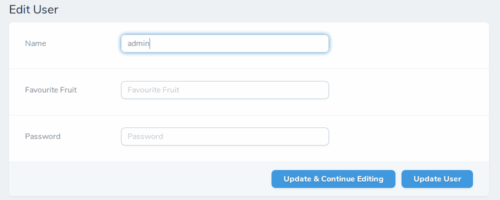

# Laravel Nova Text Auto-Complete

This [Nova](https://nova.laravel.com/) field provides a capability of auto-completed searching for results inside a text input field.




## Installation

You can install the Nova field in to a Laravel app that uses [Nova](https://nova.laravel.com) via composer:

```bash
composer require gkermer/nova-text-auto-complete
```


## Usage

To add an autocomplete text field, use the `Gkermer\TextAutoComplete\TextAutoComplete` field in your Nova resource:

```php
use Gkermer\TextAutoComplete\TextAutoComplete;
```

```php
TextAutoComplete::make('Favourite Fruit')->items([
    'Apple',
    'Apricots',
    'Avocado',
    'Banana',
    'Blueberries',
]),
```

Assuming you have an Eloquent model `Fruit` with attribute `name`, you could get the items by:

```php
TextAutoComplete::make('Favourite Fruit')->items(
    Fruit::pluck('name')
),
```

However, imagine the `Fruit` has hundreds or thousands records and the drop-down selection menu is populated with so many items. Then you could find the items like so:

```php
TextAutoComplete::make('Favourite Fruit')->items(function($search) {
    return Fruit::where('name', 'like', '%' . $search . '%')
        ->get()
        ->pluck('name');
}),
```


## License

The MIT License (MIT). Please see [License File](LICENSE) for more information.